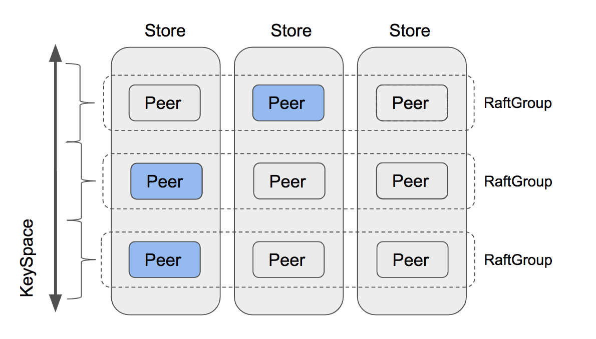
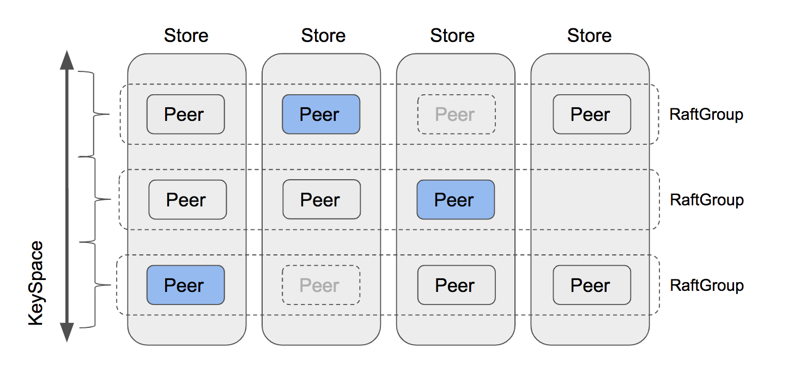

# Project3 MultiRaftKV

在 project2 中，你已经基于 Raft 构建了一个高可用的 KV 服务器，干得不错！但这还不够，这样的 KV 服务器由单个 Raft 组支持，其扩展性不是无限的，而且每个写请求都必须等待提交后才能逐一写入 badger，这是一致性的关键要求，但也扼杀了任何并发性。


在这个项目中，你将实现一个带有平衡调度器的、基于多 Raft 的 KV 服务器，它由多个 Raft 组组成，每个 Raft 组负责一个单独的键范围，这里称为 region，其布局如上图所示。对单个 region 的请求处理方式与之前相同，但多个 region 可以并发处理请求，这提高了性能，但也带来了一些新的挑战，比如平衡到每个 region 的请求等。

这个项目有 3 个部分，包括：

1.  为 Raft 算法实现成员变更和领导权变更
2.  在 raftstore 中实现 conf change 和 region split
3.  引入调度器

## Part A

在这一部分，你将为基本的 Raft 算法实现成员变更和领导权变更，这些功能是接下来两个部分所必需的。成员变更，即 conf change，用于向 Raft 组添加或移除 peer，这会改变 Raft 组的法定人数，所以要小心。领导权变更，即 leader transfer，用于将领导权转移给另一个 peer，这对于平衡非常有用。

### 代码

你需要修改的代码都在 `raft/raft.go` 和 `raft/rawnode.go` 中，另外请查看 `proto/proto/eraft.proto` 以了解你需要处理的新消息。conf change 和 leader transfer 都由上层应用程序触发，所以你可能想从 `raft/rawnode.go` 开始。

### 实现 leader transfer

要实现 leader transfer，让我们引入两种新的消息类型：`MsgTransferLeader` 和 `MsgTimeoutNow`。要转移领导权，你首先需要在当前 leader 上使用 `MsgTransferLeader` 消息调用 `raft.Raft.Step`，并为了确保转移成功，当前 leader 应首先检查受让人（即转移目标）的资格，例如：受让人的日志是否是最新等。如果受让人不合格，当前 leader 可以选择中止转移或帮助受让人，既然中止没有帮助，那就选择帮助受让人。如果受让人的日志不是最新的，当前 leader 应该向受让人发送一个 `MsgAppend` 消息，并停止接受新的提议，以防我们最终陷入循环。因此，如果受让人合格（或在当前 leader 的帮助下），leader 应该立即向受让人发送一个 `MsgTimeoutNow` 消息，在收�� `MsgTimeoutNow` 消息后，受让人应该立即开始新的选举，而不管其选举超时如何，凭借更高的任期和最新的日志，受让人有很大机会让当前 leader 下台并成为新的 leader。

### 实现 conf change

你将在这里实现的 conf change 算法不是扩展 Raft 论文中提到的可以一次性添加和/或移除任意 peer 的联合共识算法，相反，它只能逐一添加或移除 peer，这更简单，也更容易推理。此外，conf change 从调用 leader 的 `raft.RawNode.ProposeConfChange` 开始，这将提议一个 `pb.Entry.EntryType` 设置为 `EntryConfChange` 且 `pb.Entry.Data` 设置为输入的 `pb.ConfChange` 的条目。当类型为 `EntryConfChange` 的条目被提交时，你必须通过 `RawNode.ApplyConfChange` 并使用条目中的 `pb.ConfChange` 来应用它，只有这样你才能根据 `pb.ConfChange` 通过 `raft.Raft.addNode` 和 `raft.Raft.removeNode` 向此 raft 节点添加或移除 peer。

> 提示：
>
> - `MsgTransferLeader` 消息是本地消息，不来自网络
> - 你将 `MsgTransferLeader` 消息的 `Message.from` 设置为受让人（即转移目标）
> - 要立即开始新的选举，你可以使用 `MsgHup` 消息调用 `Raft.Step`
> - 调用 `pb.ConfChange.Marshal` 来获取 `pb.ConfChange` 的字节表示，并将其放��� `pb.Entry.Data`

## Part B

由于 Raft 模块现在支持成员变更和领导权变更，在这一部分，你需要让 TinyKV 在 A 部分的基础上支持这些管理命令。正如你在 `proto/proto/raft_cmdpb.proto` 中看到的，有四种类型的管理命令：

- CompactLog (已在 project 2 part C 中实现)
- TransferLeader
- ChangePeer
- Split

`TransferLeader` 和 `ChangePeer` 是基于 Raft 支持领导权变更和成员变更的命令。这些将作为平衡调度器的基本操作步骤。`Split` 将一个 Region 分裂成两个 Region，这是多 Raft 的基础。你将逐步实现它们。

### 代码

所有的更改都基于 project2 的实现，所以你需要修改的代码都在 `kv/raftstore/peer_msg_handler.go` 和 `kv/raftstore/peer.go` 中。

### 提议 transfer leader

这一步非常简单。作为一个 raft 命令，`TransferLeader` 将被提议为一个 Raft 条目。但 `TransferLeader` 实际上是一个不需要复制到其他 peer 的动作，所以你只需要为 `TransferLeader` 命令调用 `RawNode` 的 `TransferLeader()` 方法，而不是 `Propose()`。

### 在 raftstore 中实现 conf change

conf change 有两种不同的类型，`AddNode` 和 `RemoveNode`。顾名思义，它从 Region 中添加一个 Peer 或移除一个 Peer。要实现 conf change，你应该首先学习 `RegionEpoch` 这个术语。`RegionEpoch` 是 `metapb.Region` 元信息的一部分。当一个 Region 添加或移除 Peer 或分裂时，Region 的 epoch 会发生变化。RegionEpoch 的 `conf_ver` 在 ConfChange 期间增加，而 `version` 在分裂期间增加。它将用于在网络隔离的情况下保证最新的 region 信息，即一个 Region 中有两个 leader。

你需要让 raftstore 支持处理 conf change 命令。过程如下：

1.  通过 `ProposeConfChange` 提议 conf change 管理命令
2.  日志提交后，更改 `RegionLocalState`，包括 `Region` 中的 `RegionEpoch` 和 `Peers`
3.  调用 `raft.RawNode` 的 `ApplyConfChange()`

> 提示：
>
> - 对于执行 `AddNode`，新添加的 Peer 将由 leader 的心跳创建，请检查 `storeWorker` 的 `maybeCreatePeer()`。那时，这个 Peer 是未初始化的，我们不知道其 Region 的任何信息，所以我们用 0 来初始化它的 `Log Term` 和 `Index`。然后 leader 会知道这个 Follower 没有数据（存在从 0 到 5 的日志差距），它会直接向这个 Follower 发送一个快照。
> - 对于执行 `RemoveNode`，你应该显式调用 `destroyPeer()` 来停止 Raft 模块。销毁逻辑已为你提供。
> - 不要忘记更新 `GlobalContext` 的 `storeMeta` 中的 region 状态
> - 测试代码会多次调度一��� conf change 的命令，直到 conf change 被应用，所以你需要考虑如何忽略同一个 conf change 的重复命令。

### 在 raftstore 中实现 split region


为了支持 multi-raft，系统执行数据分片，并使每个 Raft 组只存储一部分数据。Hash 和 Range 是常用的数据分片方法。TinyKV 使用 Range，主要原因是 Range 可以更好地聚合具有相同前缀的键，这对于像 scan 这样的操作很方便。此外，Range 在分裂方面优于 Hash。通常，它只涉及元数据修改，不需要移动数据。

``` protobuf
message Region {
 uint64 id = 1;
 // Region key range [start_key, end_key).
 bytes start_key = 2;
 bytes end_key = 3;
 RegionEpoch region_epoch = 4;
 repeated Peer peers = 5
}
```

让我们重新看一下 Region 的定义，它包含两个字段 `start_key` 和 `end_key` 来指示 Region 负责的数据范围。所以 split 是支持 multi-raft 的关键步骤。一开始，只有一个 Region，范围是 [“”, “”)。你可以把键空间看作一个环，所以 [“”, “”) 代表整个空间。随着数据的写入，分裂检查器会每隔 `cfg.SplitRegionCheckTickInterval` 检查一次 region 大小，并在可能的情况下生成一个分裂键来将 Region 切成两部分，你可以在 `kv/raftstore/runner/split_check.go` 中检查逻辑。分裂键将被包装成一个 `MsgSplitRegion`，由 `onPrepareSplitRegion()` 处理。

为了确保新创建的 Region 和 Peer 的 id 是唯一的，这些 id 由调度器分配。这也已经提供了，所以你不需要实现它。`onPrepareSplitRegion()` 实际上为 pd worker 调度一个任务，向调度器请求 id。并在收到调度器的响应后发出一个分裂管理命令，请参见 `kv/raftstore/runner/scheduler_task.go` 中的 `onAskSplit()`。

所以你的任务是实现处理分裂管理命令的过程，就像 conf change 一样。提供的框架支持多 raft，请参见 `kv/raftstore/router.go`。当一个 Region 分裂成两个 Region 时，其中一个 Region 将继承分裂前的元数据，只修改其 Range 和 RegionEpoch，而另一个将创建相关的元信息。

> 提示：
>
> - 这个新创建的 Region 对应的 Peer 应该由 `createPeer()` 创建并注册到 router.regions。并且 region 的信息应该插入到 ctx.StoreMeta 的 `regionRanges` 中。
> - 对于网络隔离下的 region 分裂情况，要应用的快照可能与现有 region 的范围重叠。检查逻辑在 `kv/raftstore/peer_msg_handler.go` 的 `checkSnapshot()` 中。请在实现时记住这一点并处理该情况。
> - 使用 `engine_util.ExceedEndKey()` 与 region 的 end key 进行比较。因为当 end key 等于 “” 时，任何键都将等于或大于 “”。
> - 需要考虑更多的错误：`ErrRegionNotFound`、`ErrKeyNotInRegion`、`ErrEpochNotMatch`。

## Part C

如上所述，我们 kv 存储中的所有数据都被分割成若干个 region，每个 region 包含多个副本。一个问题出现了：我们应该把每个副本放在哪里？我们如何为副本找到最佳位置？谁发送之前的 AddPeer 和 RemovePeer 命令？调度器承担了这一责任。

为了做出明智的决策，调度器应该掌握整个集群的一些信息。它应该知道每个 region 在哪里。它应该知道它们有多少个 key。它应该知道它们有多大…… 为了获取相关信息，调度器要求每个 region 定期向调度器发送心跳请求。你可以在 `/proto/proto/schedulerpb.proto` 中找到心跳请求结构 `RegionHeartbeatRequest`。收到心跳后，调度器将更新本地 region 信息。

同时，调度器定期检查 region 信息，以发现我们的 TinyKV 集群中是否存在不平衡。例如，如果任何 store 包含太多 region，则应将 region 从中移动到其他 store。这些命令将作为相应 region 心跳请求的响应被接收。

在这一部分，你需要为调度器实现上述两个功能。遵循我们的指南和框架，这不会太��。

### 代码

你需要修改的代码都在 `scheduler/server/cluster.go` 和 `scheduler/server/schedulers/balance_region.go` 中。如上所述，当调度器收到一个 region 心跳时，它会首先更新其本地 region 信息。然后它会检查该 region 是否有待处理的命令。如果有，它将作为响应发送回去。

你只需要实现 `processRegionHeartbeat` 函数，调度器在其中更新本地信息；以及 `balance-region` 调度器的 `Schedule` 函数，调度器在其中扫描 store 并确定是否存在不平衡以及应该移动哪个 region。

### 收集 region 心跳

如你所见，`processRegionHeartbeat` 函数的唯一参数是一个 regionInfo。它包含了这个心跳的发送者 region 的信息。调度器需要做的只是更新本地 region 记录。但是它应该为每个心跳都更新这些记录吗？

绝对不是！有两个原因。一个原因是当该 region 没有发生任何变化时可以跳过更新。更重要的原因是调度器不能信任每个心跳。具体来说，如果集群在某个部分有分区，那么关于某些节点的信息可能是错误的。

例如，一些 Region 在被分割后重新发起选举和分裂，但另一批被隔离的节点仍然通过心跳向调度器发送过时的信息。所以对于一个 Region，两个节点中的任何一个都���能说自己是 leader，这意味着调度器不能同时信任它们。

哪一个更可信？调度器应该使用 `conf_ver` 和 `version` 来确定，即 `RegionEpoch`。调度器应该首先比较两个节点的 Region version 的值。如果值相同，调度器就比较配置变更版本的值。配置变更版本较大的节点必须有更新的信息。

简单来说，你可以按以下方式组织检查例程：

1.  检查本地存储中是否存在具有相同 Id 的 region。如果存在，并且心跳的 `conf_ver` 和 `version` 中至少有一个小于它的，则此心跳 region 是过时的。
2.  如果不存在，则扫描所有与它重叠的 region。心跳的 `conf_ver` 和 `version` 应该大于或等于所有这些 region，否则该 region 是过时的。

那么调度器如何确定是否可以跳过这次更新呢？我们可以列出一些简单的条件：

*   如果新的 `version` 或 `conf_ver` 大于原来的，则不能跳过
*   如果 leader 改变了，则不能跳过
*   如果新的或原来的有待处理的 peer，则不能跳过
*   如果 ApproximateSize 改变了，则不能跳过
*   …

别担心。你不需要找到一个严格的充分必要条件。冗余的更新不会影响正确性。

如果调度器决定根据此心跳更新本地存储，它应该更新两件事：region 树�� store 状态。你可以使用 `RaftCluster.core.PutRegion` 来更新 region 树，并使用 `RaftCluster.core.UpdateStoreStatus` 来更新相关 store 的状态（例如 leader 数量、region 数量、待处理 peer 数量……）。

### 实现 region 平衡调度器

调度器中可以运行许多不同类型的调度器，例如，balance-region 调度器和 balance-leader 调度器。本学习材料将重点关注 balance-region 调度器。

每个调度器都应该实现 Scheduler 接口，你可以在 `/scheduler/server/schedule/scheduler.go` 中找到它。调度器将使用 `GetMinInterval` 的返回值作为定期运行 `Schedule` 方法的默认间隔。如果它返回 null（重试几次后），调度器将使用 `GetNextInterval` 来增加间隔。通过定义 `GetNextInterval`，你可以定义间隔如何增加。如果它返回一个 operator，调度器将把这些 operator 作为相关 region 下一次心跳的响应来分派。

Scheduler 接口的核心部分是 `Schedule` 方法。该方法的返回值是 `Operator`，它包含多个步骤，例如 `AddPeer` 和 `RemovePeer`。例如，`MovePeer` 可能包含 `AddPeer`、`transferLeader` 和 `RemovePeer`，这些你已经在前面的部分实现了。以下图中的第一个 RaftGroup 为例。调度器试图将 peer 从第三个 store 移动到第四个。首先，它应该为第四个 store `AddPeer`。然后它检查第三个是否是 leader，发现不是，所以不需要 `transferLeader`。然后它移除第三个 store 中的 peer。

你可以使用 `scheduler/server/schedule/operator` 包中的 `CreateMovePeerOperator` 函数来创建一个 `MovePeer` operator。





在这一部分，你唯一需要实现的函数是 `scheduler/server/schedulers/balance_region.go` 中的 `Schedule` 方法。这个调度器避免了在一个 store 中有太多的 region。首先，调度器将选择所有合适的 store。然后根据它们的 region 大小对它们进行排序。然后调度器尝试从 region 大小最大的 store 中寻找要移动的 region。

调度器会尝试在 store 中找到最适合移动的 region。首先，它会尝试选择一个 pending region，因为 pending 可能意味着磁盘过载。如果没有 pending region，它会尝试寻找一个 follower region。如果仍然无法挑选出一个 region，它会尝试挑选 leader region。最后，它会选出要移动的 region，否则调度器会尝试下一个 region 大小较小的 store，直到所有 store 都被尝试过。

在你挑选出一个要移动的 region 后，调度器将选择一个 store 作为目标。实际上，调度器会选择 region 大小最小的 store。然后调度器会判断这次移动是否有价值，通过检查原始 store 和目标 store 的 region 大小的差异。如果差异足够大，调度器应该在目标 store 上分配一个新的 peer，并创建一个 move peer operator。

你可能已经注意到，上面的例程只是一个粗略的过程。还留下了很多问题：

*   哪些 store 适合移动？

简而言之，一个合适的 store 应该是 up 状态，并且 down time 不能超过集群的 `MaxStoreDownTime`，你可以通过 `cluster.GetMaxStoreDownTime()` 获取。

*   如何选择 region？

调度器框架提供了三种获取 region 的方法。`GetPendingRegionsWithLock`、`GetFollowersWithLock` 和 `GetLeadersWithLock`。调度器可以从中获取相关的 region。然后你可以选择一个随机的 region。

*   如何判断这个操作是否有价值？

如果原始 store 和目标 store 的 region 大小差异太小，在我们把 region 从原始 store 移动到目标 store 后，调度器下次可能又想移回来。所以我们必须确保差异必须大于 region 近似大小的两倍，这确保了移动后，目标 store 的 region 大小仍然小于原始 store。
